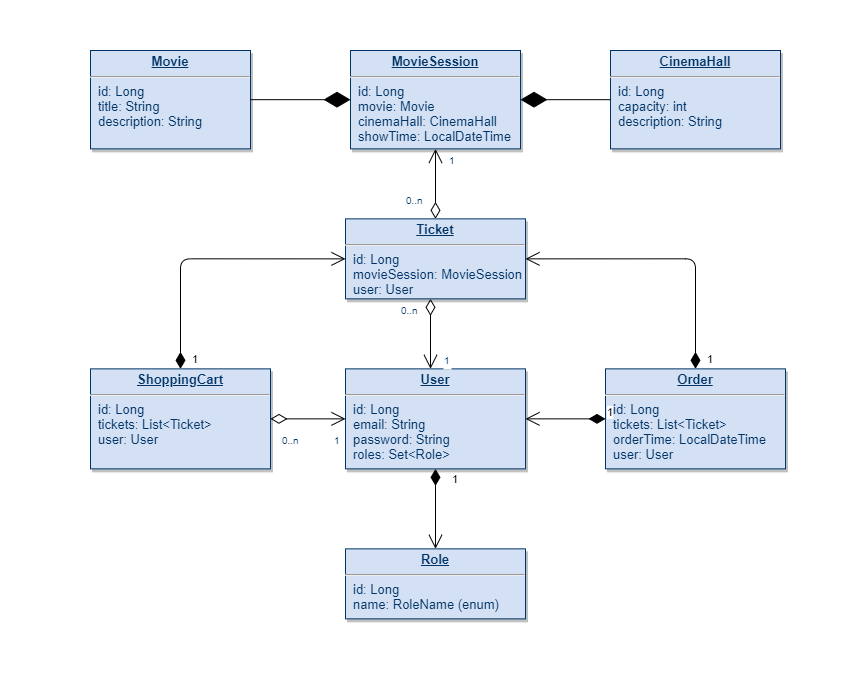

# Cinema application
A quite simple REST application that represents the work of the cinema, where user can buy tickets for a specific movie session (definite movie in definite cinema hall). To buy tickets user firstly adds them to the shopping cart and then completes an order. There are authentication and authorization. User can have different roles: USER, ADMIN, or no role. 

A person without role can:
-
- register
- view all available movie sessions
- view all movies
- view all cinema halls

A user can:
-
- add the ticket for movie to the shopping cart
- view all the tickets in the shopping cart
- complete the order
- view a history of all the orders

An admin can:
- 
- view a list of all films
- find user by email
- create new film
- create new cinema hall
- create new movie session, and also delete and update it.

## **Technologies used**

- Spring - Core / MVC / Web / Security
- Hibernate
- DataBase - MySQL
- Packaging - Apache Maven
- Tomcat

## **Configuration:**

- Сlone this project into your local folder and open the project in an IDE.
- Setup new connection in "src/main/resources/db.properties" and set your: driver, url, username and password
- Configure Tomcat (Local) with : Deployment - war_exploded, context address - "/"
- Run a project
- Admin and User will be added to your database when program start. You can log in as: Admin: (name: "alice@gmail.com", password:"12345"), or
  User: (name: "bob@gmail.com", password:"1234")
